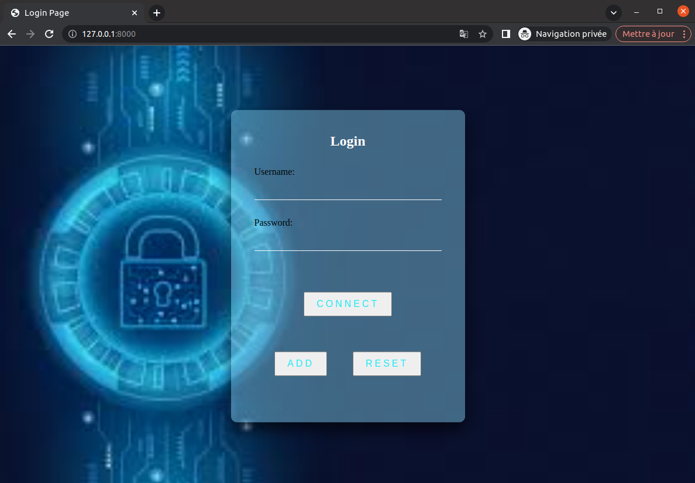

<!-- À propos du projet -->
## À propos du projet

Le projet a pour objectif de créer une page web d'identification sécurisé.

L'utilisateur peut se connecter grâce à son pseudo et son mot de passe.

L'utilisateur peut créer un nouveau compte en saisisant un nouveau pseudo et son mot de passe.  
Les fonctionnalités de sécurité sont :
* Chiffrement du mot de passe en MD5 dans la base de donnée
* Controle du mot de passe
* Controle de l'existence de l'utilisateur
* Controle de la complexité du mot de passe lors de la création de compte
* Bloquage du compte pendant une minute si l'utilisateur a fait trois saisies de mot de passe incorrects


<!-- Comment utiliser le projet -->
## Comment utiliser le projet

J'ai réalisé le projet en utilisant le framework Django.  
Django est un framework web open source en Python.  
Il a pour but de rendre le développement d'applications web simple.

### Installation

Les installations nécessaires pour le lancement du projet sont :
* python
* django

Les librairies python suivantes sont à installer:
  ```sh
  pip install DateTime
  ```
  ```sh
  pip install regex
  ```
  ```sh
  pip install hashlib
  ```


### Lancement du projet

Après avoir effectué les installations et téléchargé le dépot git, voici les commandes à effectuer.
 ```sh
 python3 manage.py migrate --run-syncdb
  ```
   ```sh
  python3 manage.py migrate
  ```
   ```sh
  python3 manage.py makemigrations
  ```
  ```sh
  python3 manage.py runserver 8000
  ```
  
  La page web de login est ainsi disponible sur le lien suivant : http://127.0.0.1:8000/
  

  
## Description des dossiers

### templates

Ce dossier contient les HTML de la page principale, la page d'ajout d'un nouveau utilisateur et la page d'un utilisateur connecté.

### static 

Ce dossier contient le css et une image de l’application


## Description des fichiers

### db.sqlite3
Ce fichier est la base de donnée.
Dans ce projet je manipule deux tables qui sont : 
* myDjangoProject_ident
* myDjangoProject_log

### models.py 
Ce fichier permet de créer deux modèles qui sont sauvegardés dans la base de donnée.

Le modèle "Ident" sert à sauvegarder les utilisateurs créés.  
Ce modèle me permet d'avoir une table avec tous les utilisateurs et leurs mot de passe chiffré.  
Les informations sont sauvegardées dans la table myDjangoProject_ident.

Le modèle "Log" sert à sauvegarder chaque tentative de connection d'un utilisateur.  
Ce modèle me permet d'avoir une table avec chaque connection qu'elle soit réussi, échoué ou bloqué selon le nom de l'utilisateur.  
Lorsqu'un utilisateur a une connection :
* réussi : Le pseudo et le mot de passe chiffré sont sauvegardés
* échoué ou bloqué : Le pseudo et le mot de passe en clair
Le modèle "Log" a divers paramètre comme la date et l'heure de la tentative de connection, cela me permet de définir au bout de combien de temps l'utilisateur est bloqué si il a fait 3 tentatives de mot de passe incorrect.
Les informations sont sauvegardées dans la table myDjangoProject_log

### forms.py
Ce fichier me permet de pouvoir afficher le modèle Ident dans la fenêtre.  
Ainsi l'utilisateur peut voir les différents champs de saisies.

### views.py 

Ce fichier contient les fonctions back-end.

Les fonctions qui permettent les intéractions entre l'utilisateur et l'application.  
Soit les fonctions suivantes :
* Intéractions boutons : Add ( Ajouter un compte ), Connect ( Permet de se connecter) , Reset ( Efface les champs saisies) ,
* Sauvegarder un utilisateur avec son mot de passe crypté dans la base de donnée,
* Historiser les connections dans la base de donnée,
* Vérifier que l'utilisateur existe et que son mot de passe est valide,
* Vérifier que l'utilisateur n'est pas bloqué sinon empêcher toute connection pendant 1 minute,

## Utilisateur test

Voici un utilisateur enregistrer pour tester dans la base de donnée : db.sqlite3 

username : toto  
mot de passe : bvF5fus0LEw0PQ61


